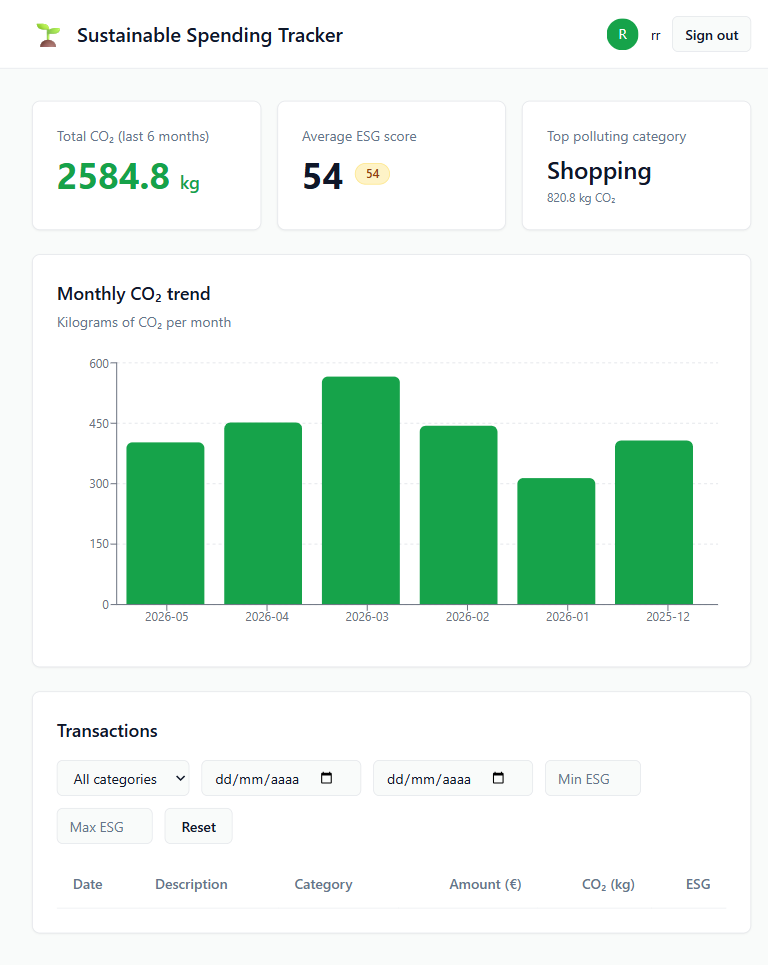

# Sustainable Spending Tracker (SST)

[](https://github.com/rogerllinares/sustainable-spending-tracker-api/actions/workflows/ci.yml)
[](https://sst-frontend-steel.vercel.app)
[](LICENSE)


Turn bank transactions into a carbon footprint + ESG score per purchase. Full-stack portfolio piece — Kotlin/Spring Boot backend, React/TypeScript dashboard, deployed on Render + Vercel + Supabase.

**▶ Live demo: https://sst-frontend-steel.vercel.app** *(use any name + email to log in)*

> ⏱ **Cold start:** Render free tier sleeps after 15 min idle. The first request after a cold start takes ~50s — the dashboard shows a skeleton while it wakes up.

**Status:** shipped (2026-05-12, hardened 2026-05-18) — frontend + backend live, 4-dimension audits passed (UI/Code/CSO/SEO + Karpathy), 18/18 backend gradle tests green, **13/13 frontend Vitest tests green**, dark mode + mobile responsive.

## Endpoints

- **Frontend:** https://sst-frontend-steel.vercel.app
- **API:** https://sst-api-hxmn.onrender.com (Swagger: `/swagger-ui.html`)
- **DB:** Supabase Postgres (eu-central-1, pooler `aws-1-eu-central-1`)

## Stack

- **Backend:** Kotlin · Spring Boot 3.5 · PostgreSQL · Flyway · TDD with MockK
- **Frontend:** React 19 · TypeScript · Vite · Tailwind · shadcn/ui · Recharts · TanStack Query
- **Tests:** Vitest + Testing Library (frontend) · JUnit + MockK (backend) · Playwright (E2E smoke)
- **Theme:** Light + dark mode (localStorage + `prefers-color-scheme` fallback)
- **Auth:** Mock login form (portfolio demo). Architecture is OAuth-ready — see *Possible improvements*.
- **Infra:** Docker · Vercel (frontend) · Render (backend) · Supabase (DB)

## Screenshots



## How ESG and CO₂ are computed

Every transaction has a **Merchant Category Code (MCC)** — the same 4-digit code Visa/Mastercard use to classify merchants (5411 = grocery, 5541 = gas stations, etc.). At seed time the DB is preloaded with a small `mcc_score` table mapping each MCC to:

- `co2_per_eur` — kg of CO₂ emitted per euro spent in that category (sourced from public emission-factor datasets, illustrative not authoritative)
- `esg_score` — 0–100 sustainability score for the category

When a transaction arrives, the backend looks up its MCC and computes:

```
co2_kg = amount_eur × co2_per_eur     (rounded to 3 decimals)
esg_score = mcc.esg_score             (50 default if MCC unknown)
```

See [`EsgScoringService.kt`](src/main/kotlin/com/rogerllina/sst/service/EsgScoringService.kt) and the seed migration in [`db/migration/`](src/main/resources/db/migration/). The methodology is deliberately simple — the goal is to demonstrate the end-to-end pipeline (transaction ingest → categorisation → aggregation → dashboard), not to publish carbon estimates. Real-world products would layer in merchant-level overrides, currency conversion, and audited emission factors.

## Run locally

1. **Backend:**
   ```bash
   docker-compose up
   ```
   (or `./gradlew bootRun` with a local Postgres on `:5432`)

2. **Seed mock data:**
   ```bash
   curl -X POST http://localhost:8080/api/admin/seed
   ```

3. **Frontend:**
   ```bash
   cd sst-frontend
   npm install
   npm run dev
   ```

4. Open http://localhost:5173 → enter any name + email → explore the dashboard.

## API

Swagger UI: http://localhost:8080/swagger-ui.html

Key endpoints:

| Endpoint | Description |
|---|---|
| `POST /api/admin/seed` | Seeds 90 mock transactions (6 months) |
| `GET /api/dashboard/summary` | Total CO₂, avg ESG, monthly trend |
| `GET /api/dashboard/categories` | CO₂/ESG breakdown by category |
| `GET /api/transactions` | Paginated list with filters: `category`, `dateFrom`, `dateTo`, `minScore`, `maxScore`, `page`, `size` |

## Project structure

```
sst/
├── src/main/kotlin/com/rogerllina/sst/   ← Backend (controllers, services, repos, JPA)
├── src/main/resources/db/migration/       ← Flyway V1–V4
├── sst-frontend/                          ← React + TS dashboard
│   ├── src/api/                           ← axios + React Query hooks
│   ├── src/auth/                          ← AuthContext + ProtectedRoute
│   ├── src/components/                    ← Hero, TrendChart, TransactionsTable, EsgBadge, shadcn/ui
│   └── src/pages/                         ← LoginPage, DashboardPage
├── docker-compose.yml
└── Dockerfile                             ← multi-stage build
```

## Possible improvements

- **Real auth:** replace the mock login form with OAuth (Google, GitHub). The `AuthContext` and Bearer interceptor are already wired — only `LoginPage` and a backend Spring Security Resource Server need swapping in. The plan is to port the OAuth flow from the `Apostes Automatitzades` project once that ships.
- Move dashboard aggregation from in-memory to SQL `GROUP BY` (current implementation is correct but does not scale beyond ~10k transactions).
- Code-split the Recharts bundle (currently ~210 KB gzipped initial chunk).
- Real emission factors via an audited dataset (e.g. Carbon Cloud, Klima) and merchant-level overrides instead of MCC-only.
- CI/CD via GitHub Actions (`npm test && npm run build && vercel deploy` on push to `master`).
